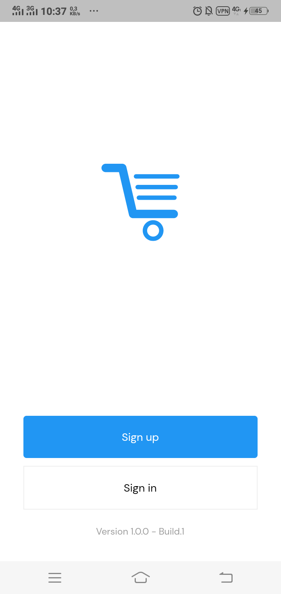
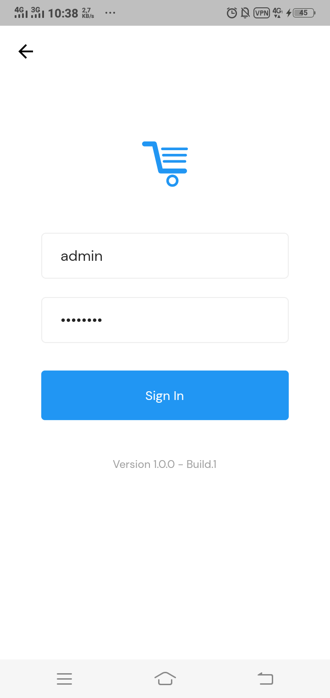
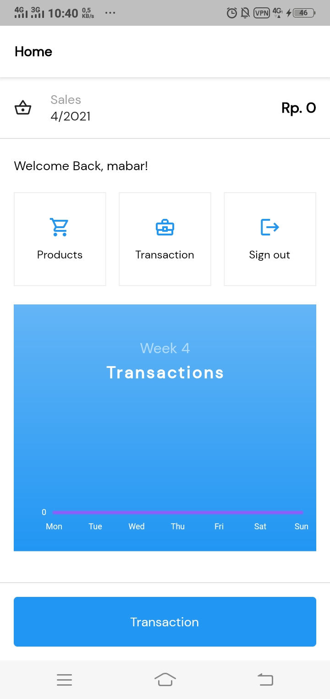

## Information System Point of Sales

E-Business Technology and Infrastructure study program assignment at **State University of Surabaya**.

---

### Feature

1. Barcode Scanner
2. Inventory Tracker
3. Summary of Sales
4. Weekly Sales Graph

### Screenshot

&nbsp; &nbsp; &nbsp; &nbsp; 

### Release

<https://drive.google.com/file/d/1PMmv9ggewPac_kyiQmAiharEimPNxnkX/view?usp=sharing>
